# 🛒 IMPORTS MRK - Loja Virtual

<!-- Descrição principal -->
Este é um projeto completo de e-commerce fictício, desenvolvido com **HTML, CSS, JavaScript**, e um **backend em Node.js com Express e MySQL**.

---

## 📌 Funcionalidades

### 🖥️ Frontend
- Página principal com carrossel de banners (`index.html`)
- Catálogo de produtos (`index.html`, `lancamentos.html`, `detalhes.html`, `oferta.html`)
- Cadastro e login de usuários (`cadastrologin.html`, `login.html`)
- Adição de produtos ao carrinho (`carrinho.html`) com `localStorage`
- Finalização de compra com formulário e escolha de pagamento (`finalizar.html`)

### 🔙 Backend (Node.js + Express + MySQL)
- API RESTful com rotas para produtos, clientes, login e pedidos
- Integração com banco MySQL (`mrk`)
- Senhas com criptografia `bcrypt`
- Middleware CORS e suporte para JSON

---

## 🖼️ Capturas de Tela

### Página Inicial
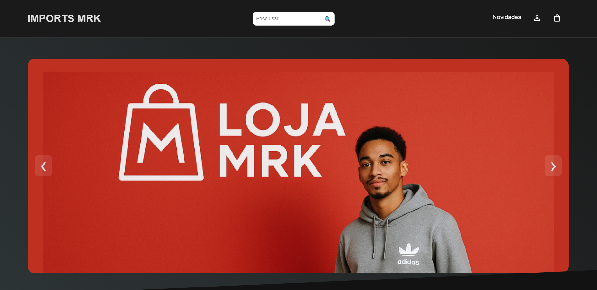

### Tela Novidades


### Tela de Login
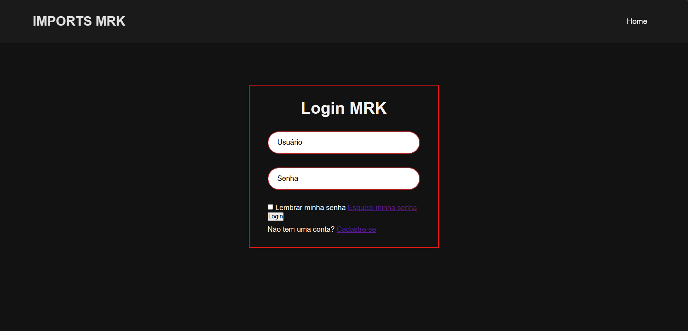

---

## ⚙️ Tecnologias Utilizadas

**Frontend**: HTML, CSS, JS puro, Font Awesome, LocalStorage  
**Backend**: Node.js, Express, MySQL, Bcrypt, Cors  
**Banco de Dados**: Script SQL (`mrk_banco.sql`) com tabelas e relacionamentos

---

## 🗃️ Estrutura do Projeto

```bash
/
├── frontend/
│   ├── index.html                                Página inicial da loja, com destaque para produtos e carrossel
│   ├── login.html                                Página de login para clientes já registrados
│   ├── cadastrologin.html                        Tela de cadastro de novos usuários
│   ├── carrinho.html                             Visualização do carrinho com produtos e total de compra
│   ├── finalizar.html                            Etapa de checkout: preenchimento de endereço e forma de pagamento
│   ├── detalhes.html                             Detalhes de um produto específico (imagens, descrição, etc.)
│   ├── lancamentos.html                          Lista de novos produtos (novos lançamentos)
│   ├── cadastrarPD.html                          Tela para cadastro de novos produtos (uso administrativo)
│   ├── oferta.html                               Página para promoções e ofertas (ainda em teste)
│   ├── style.css                                 Arquivos principais de estilos visuais (cores, fontes, layout)
│   ├── style2.css                                Estilo específico do carrinho e layouts adicionais
│   ├── styles.css                                Estilo específico do carrinho e layouts adicionais
│   ├── style-cadastroPD.css                      Estilo específico da página de cadastro de produtos
│   ├── finalizar.css                             Estilo da tela de finalização de compras
│   └── assets/                                   Pasta com imagens (como prints usados no README)
│       ├── home.png
│       ├── detalhe.png
│       ├── login.png
│
├── backend/
│   ├── index.js                                  Principal arquivo do servidor Express (rotas, conexões, lógica de API)
│   ├── package.json                              Lista de dependências e scripts do projeto Node.js
│   ├── package-lock.json                         Registro detalhado das versões instaladas (gerado pelo npm)
│   ├── .gitignore                                Arquivos e pastas ignorados pelo Git (ex: node_modules)
│
├── database/
│   ├── mrk_banco.sql                             Criação de tabelas cliente, produto, compra, pagamento, com seus relacionamentos
```

### Primeira Rota
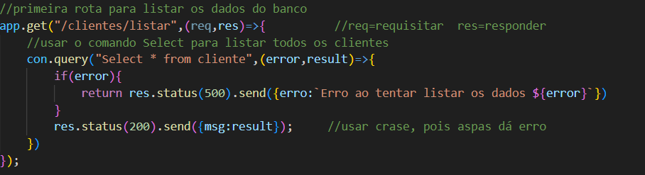
### Segunda Rota
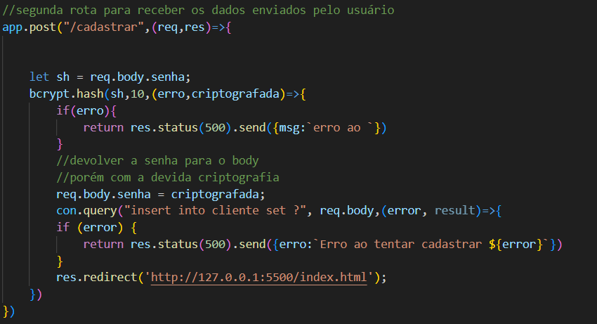
### Rota Produto
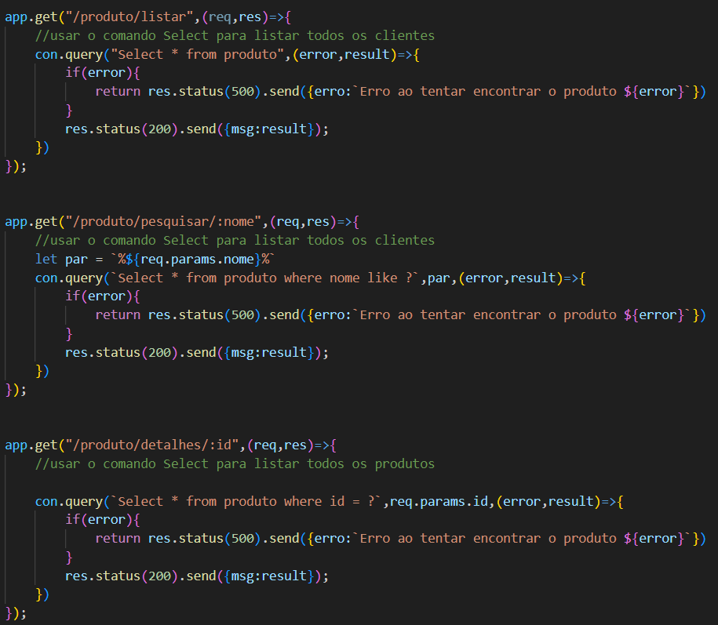
### Rota Login
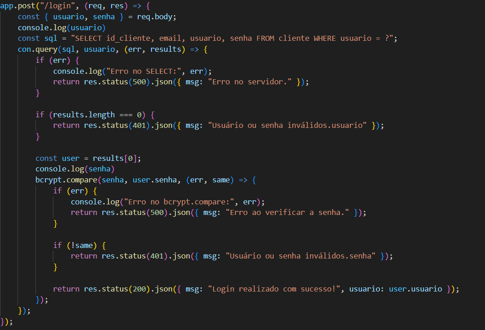
### Rota Compra
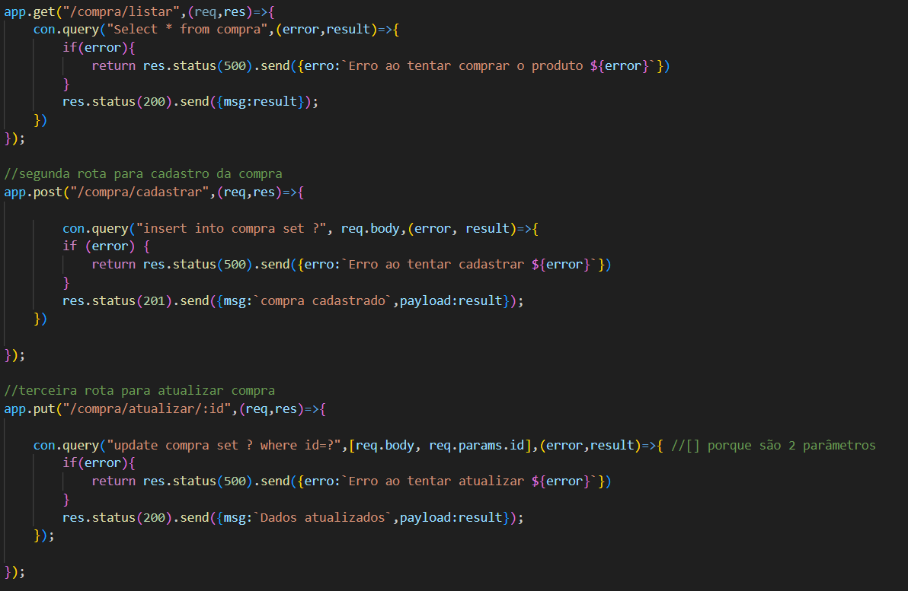
### Rota Recuperar Senha
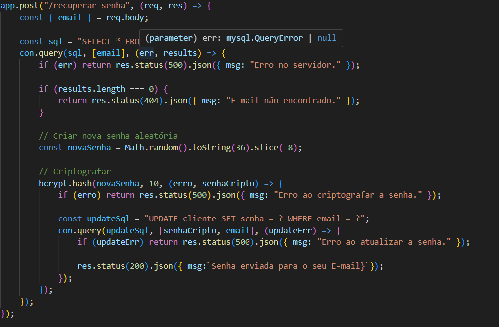

### Modelo logico
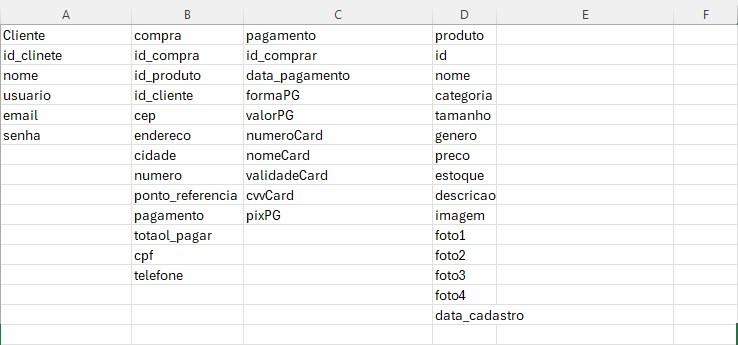
---
### Normalização
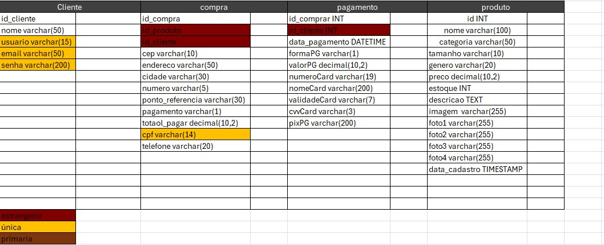
---

## 🏦 Sql Banco de dados 

```bash
/
├── create database mrk;
use mrk;

create table cliente(
id_cliente int auto_increment primary key,
nome varchar(50) not null,
usuario varchar(15) not null,
email varchar(50) not null,
senha varchar (200)not null
);

create table compra(
id_compra int auto_increment primary key,
id int ,
id_cliente int,
cep varchar(10) not null,
endereco varchar(50) not null,
cidade varchar(30) not null,
numero varchar(5) not null,
ponto_referencia varchar(30),
total_pagar decimal(10,2),
cpf varchar(14) not null,
telefone varchar(20) not null,
data_pagamento DATETIME,
formaPG varchar(10) not null,
numeroCard varchar(19) not null,
nomeCard varchar(200)not null,
validadeCard varchar(7) not null,
cvvCard varchar (3) not null,
pixPG varchar(200)not null
);

CREATE TABLE produto (
    id INT AUTO_INCREMENT PRIMARY KEY,
    nome VARCHAR(100),
    categoria VARCHAR(50),
    tamanho VARCHAR(10),
    genero VARCHAR(20),
    preco DECIMAL(10 , 2 ),
    estoque INT,
    descricao TEXT,
    imagem VARCHAR(255),
    foto1 VARCHAR(255),
    foto2 VARCHAR(255),
    foto3 VARCHAR(255),
    foto4 VARCHAR(255),
    data_cadastro TIMESTAMP
);


alter table compra
add constraint fk_cliente_pk_cliente
foreign key compra(id_cliente)
references cliente(id_cliente);

alter table compra
add constraint fk_id_pk_id
foreign key compra(id)
references produto(id);

```
### Diagrama do relacionamento MRK
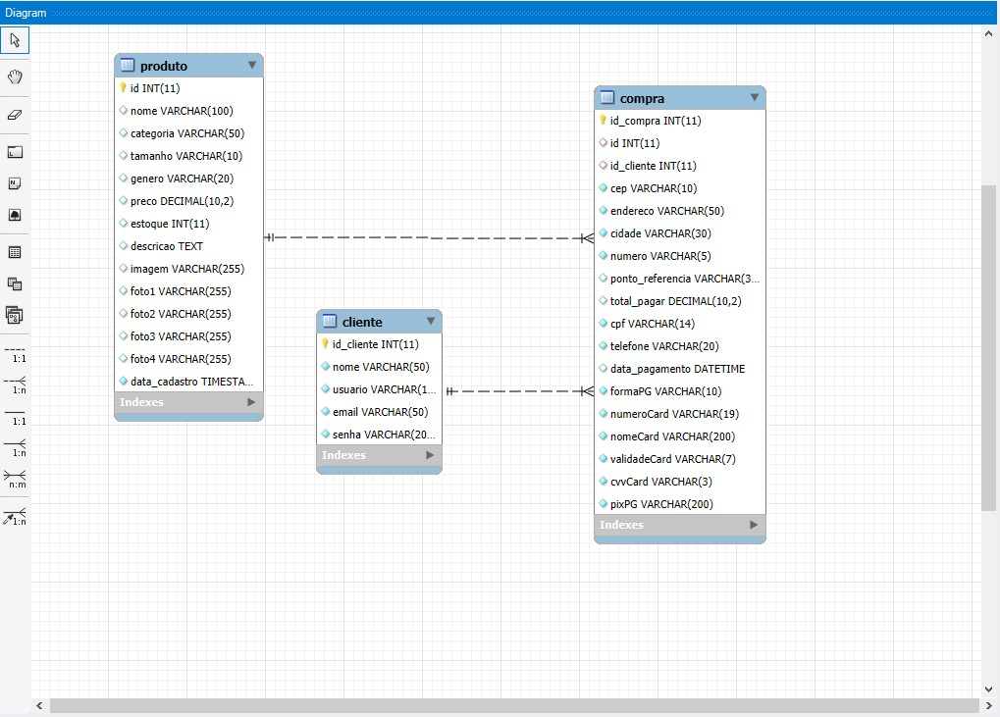

## ▶️ Como Executar

### Backend

```bash
cd backend
npm install
npm start (nodemon)
```

Servidor: `http://127.0.0.1:3000`

> Importar o banco de dados via `mrk_banco.sql`.

### Frontend

Abrir qualquer arquivo HTML diretamente no navegador, ou usar Live Server no VSCode.

---

## 🧑‍💻 Autor

Desenvolvido por **[Renan ferreira e Marcos Victor]** — projeto educacional de e-commerce com Node e frontend puro.
